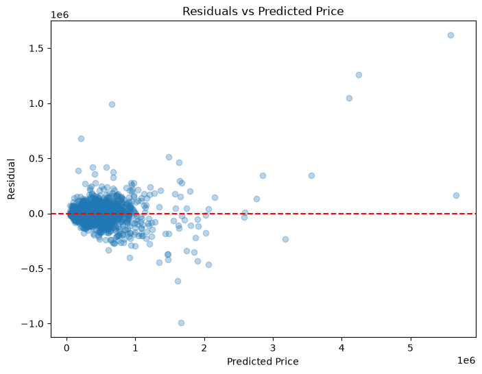
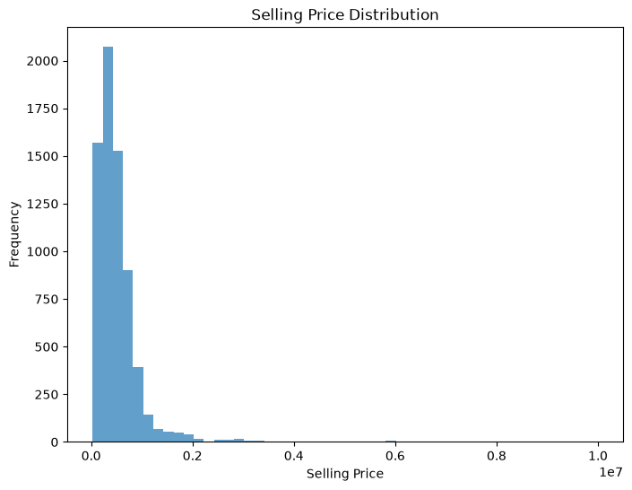

# Used Car Price Prediction — Final Report

**Project:** Predict the resale value of used cars from Cardekho listings
**Data:** 8,128 listings, 13 raw attributes
**Deliverable:** Trained Random Forest pipeline (`models/car_price_pipeline.joblib`) + CLI/API + Streamlit demo app

---

## 1. Objective

Estimate the fair selling price (in Indian Rupees) of a used car given its
specifications and usage history. The business value is twofold: sellers can
price their cars realistically, and buyers can detect overpriced listings.

## 2. Dataset

| Aspect | Detail |
|---|---|
| Source | Cardekho used-car listings (Kaggle, `car details v4.csv`) |
| Raw rows | 8,128 |
| Usable rows (after cleaning) | 6,926 |
| Raw columns | name, year, km_driven, fuel, seller_type, transmission, owner, mileage, engine, max_power, torque, seats, **selling_price** (target) |
| Target distribution | Right-skewed; median well below mean (a few high-value cars dominate) |

The three heavy text fields — `mileage`, `engine`, `max_power`, `torque` — encode
numeric values inside strings (e.g. `"23.4 kmpl"`, `"1248 CC"`, `"74 bhp"`,
`"190Nm@ 2000rpm"`). Parsing them (and splitting torque into `torque_nm`,
`torque_rpm_min`, `torque_rpm_max`) was the core of the cleaning step.

## 3. Methodology

### 3.1 Cleaning (`src/data/cleaning.py`)

- Parse `mileage` → numeric kmpl; `engine` → `engine_cc`; `max_power` → `max_power_bhp`
- Split `torque` into torque value and RPM band; normalize all units (Nm, rpm)
- Drop rows where parsing failed or `selling_price` is missing (1,202 rows)
- Encode categoricals (`fuel`, `seller_type`, `transmission`, `owner`)

### 3.2 Feature engineering (`src/features/engineering.py`)

- `vehicle_age` = latest listing year − car year
- `km_per_year` = `km_driven` / `vehicle_age` (normalizes usage intensity)
- `power_per_cc` = `max_power_bhp` / `engine_cc` (specific output)
- `brand` = first word of the car name (Maruti, Hyundai, Toyota, …)

Final feature set: **12 numeric + 5 categorical** (17 total).

### 3.3 Modeling

Preprocessing: median imputation + StandardScaler on numerics;
most-frequent imputation + OneHotEncoder(handle_unknown="ignore") on categoricals.
Split: 80/20 stratified-by-none, fixed seed 42.

Linear family was trained on `log1p(target)` (heavy right skew); tree models on
raw target. Hyperparameter search (GridSearchCV) was run for Random Forest.

| Model | Test MAE | Test RMSE | Test R² |
|---|---|---|---|
| Linear Regression | 86,389 | 156,803 | 0.8879 |
| Ridge Regression | 88,395 | 165,630 | 0.8749 |
| Lasso / ElasticNet | ~90,600 | ~173,700 | < 0.87 |
| Gradient Boosting | 77,645 | 127,935 | ~0.93 |
| **Random Forest (final)** | **70,738** | **122,077** | **0.9321** |

Final hyperparameters: `n_estimators=500, min_samples_split=5,
min_samples_leaf=1, max_features=1.0, random_state=42`.

## 4. Results



The residual plot shows a tight band around zero for cars priced under
~Rs 5 Lakh, with expected scatter on premium cars (their price is driven by
condition and rarity — features we do not observe).



- **Test R² = 0.9321** — the model explains 93.2% of price variance on unseen cars
- **Test RMSE = Rs 122,077** (~24% of the mean price of Rs 517k)
- **Test MAE = Rs 70,738** (~14% of mean price, ~18% of the Rs 400k median)
- Prediction range on the held-out split: Rs 45,517 – Rs 5,667,087

### Feature importance (Random Forest)

| Feature | Importance |
|---|---|
| max_power_bhp | 54% |
| year | 11% |
| vehicle_age | 11% |
| torque_nm | 9% |
| km_driven | 4% |

Engine output dominates resale value — expected in the Indian market, where
displacement/power maps directly to the price bracket a car competes in.

## 5. Productionization

The winning pipeline is persisted as `models/car_price_pipeline.joblib` and
wrapped in a small `src/models` package:

```bash
python -m src.models.train                    # retrain + persist artifact
python -m src.models.predict --input '<json>' # one-off prediction
python -m src.models.evaluate                 # re-score the artifact
streamlit run app.py                          # interactive demo UI
```

All model/config details (features, hyperparameters, artifact path) live in
`configs/model_config.yaml`, so retraining never drifts from documented
choices. CI (GitHub Actions) runs ruff + the test suite on every push.

## 6. Conclusions & Future Work

- A tuned Random Forest reaches **93% R²** with interpretable feature importances;
  linear models trail significantly (the price surface is non-linear).
- **Limitation:** unobserved factors (condition, accident history, service
  records) cap accuracy on premium listings — residuals grow with price.
- **Future work:** image-based condition scoring, listing-price time series
  (depreciation curves per brand), SHAP explanations surfaced in the demo app,
  and serving via FastAPI with the persisted artifact.
